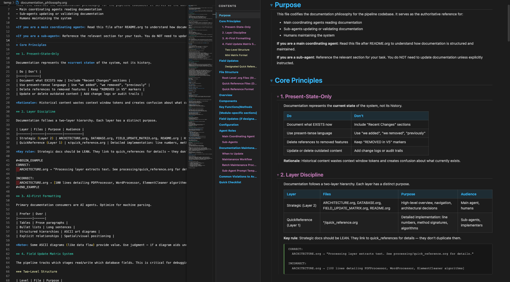

# Org Viewer

A live preview panel for Emacs Org-mode (`.org`) files in VS Code — just like the built-in Markdown preview.



## Features

- **Live preview** — Open a `.org` file, press `Cmd+K V`, and see rendered HTML side-by-side. Edits update in real time.
- **Collapsible sections** — Click any heading to collapse/expand its content. Chevron indicators show section state.
- **Sticky headings** — Headings pin to the top as you scroll, stacking neatly without overlapping.
- **Table of contents** — Fixed sidebar with color-coded headings, click-to-navigate, and scroll spy highlighting.
- **Token count** — See the file's token count in the TOC header — useful for managing AI context window budgets.
- **Syntax highlighting** — Code blocks highlighted with VS Code Dark+ colors via highlight.js (~40 languages).
- **File reference detection** — File paths in your document are automatically detected and color-coded by type. `.org` references are clickable and open directly in the editor.
- **Org-mode rendering** — Headings, lists, tables, links, images, blockquotes, code blocks, math, horizontal rules, and more.
- **Metadata support** — `#+TITLE`, `#+AUTHOR`, `#+DATE`, planning lines (SCHEDULED/DEADLINE/CLOSED), property drawers, custom drawers, and CLOCK entries.
- **TODO/DONE badges** — Color-coded keyword badges, priority cookies (`[#A]`/`[#B]`/`[#C]`), and tags as pill badges.
- **Checkboxes** — `[X]`, `[ ]`, and `[-]` rendered as Unicode symbols.
- **Theme-aware** — All styles respect your VS Code theme (light, dark, and high-contrast).

## Keybindings

| Shortcut | Action |
|----------|--------|
| `Cmd+Shift+V` | Open preview (replaces current pane) |
| `Cmd+K V` | Open preview to the side (split view) |

## Getting Started

1. Install the extension from the [VS Code Marketplace](https://marketplace.visualstudio.com/items?itemName=johannes-exe-or-something.org-viewer)
2. Open any `.org` file
3. Click the preview icon in the editor title bar, or press `Cmd+K V`

## File Reference Colors

File paths mentioned in your documents are automatically styled:

| Type | Extensions | Color |
|------|-----------|-------|
| Org files | `.org` | Blue (clickable) |
| Docs | `.md`, `.rst`, `.txt` | Purple |
| Code | `.py`, `.js`, `.ts`, `.go`, `.rs`, etc. | Yellow |
| Config | `.json`, `.yaml`, `.toml`, `.xml`, etc. | Orange |

## Contributing

```bash
git clone https://github.com/johannes-exe/org-viewer.git
cd org-viewer
npm install
npm run build
```

Press **F5** in VS Code to launch the Extension Development Host.

See `README.org` for the full developer reference (architecture, pipeline details, known issues).

## License

[MIT](LICENSE)
